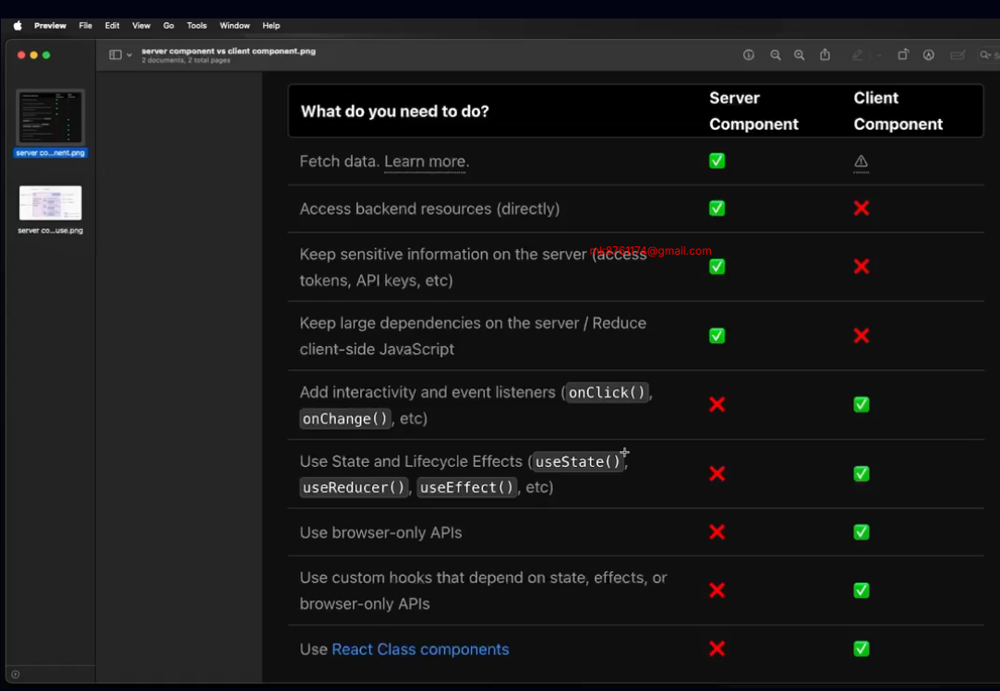

This is a [Next.js](https://nextjs.org) project bootstrapped with [`create-next-app`](https://nextjs.org/docs/app/api-reference/cli/create-next-app).

## Getting Started

First, run the development server:

```bash
npm run dev
# or
yarn dev
# or
pnpm dev
# or
bun dev
```

Open [http://localhost:3000](http://localhost:3000) with your browser to see the result.

You can start editing the page by modifying `app/page.tsx`. The page auto-updates as you edit the file.

This project uses [`next/font`](https://nextjs.org/docs/app/building-your-application/optimizing/fonts) to automatically optimize and load [Geist](https://vercel.com/font), a new font family for Vercel.

## Learn More

To learn more about Next.js, take a look at the following resources:

- [Next.js Documentation](https://nextjs.org/docs) - learn about Next.js features and API.
- [Learn Next.js](https://nextjs.org/learn) - an interactive Next.js tutorial.

You can check out [the Next.js GitHub repository](https://github.com/vercel/next.js) - your feedback and contributions are welcome!

## Deploy on Vercel

The easiest way to deploy your Next.js app is to use the [Vercel Platform](https://vercel.com/new?utm_medium=default-template&filter=next.js&utm_source=create-next-app&utm_campaign=create-next-app-readme) from the creators of Next.js.

Check out our [Next.js deployment documentation](https://nextjs.org/docs/app/building-your-application/deploying) for more details.

## 51-5 Basic routing concept and nested routing

- first create folder then create page.tsx and folder must be  create in src/app directory

- nested Routing


## 51-6 Exploring dynamic routes and catch-all routes
- first create folder in  third bracket [blogId] then create page.tsx
- under the folder  in app directory all folder by default server component

- ReactPromise

- in the nextjs params,search params,cookies 
these all provide to promise thats way if we are access the value must be use async/await 
- blog/[blogId]/page.stx
```js
import React from 'react';

const DynamicBlogPage =async ({params}:{params: Promise<{blogId: string }>}) => {
   const {blogId} = await params;
    return (
        <div>
            <h1>Dynamic blog page blogId:{blogId}</h1>
        </div>
    );
};

export default DynamicBlogPage;
```
- blog/[..slug]/page.stx
```js
import React from 'react';

const CatchAllRoutes =async ({params}:{params:Promise<{slug:string[]}>}) => {
   const {slug} = await params
    return (
        <div>
            <h1 className='text-4xl'> catch all routes :{slug}</h1>
        </div>
    );
};

export default CatchAllRoutes;
```

## 51-7 Let's dive deep into React server components

in the server component not work client component action suppose useState,useEffect, etc
 so if we are want to use these action use ✅"use Client"
 then all client  action worked and this is client component not server component ❌ but this is not best practice

 #### best practice
 
 for this file which function need action for example search button,order button 
 this folder we create extra component and call this function not need full file create use client
 

## 51-8 Link and Programmatic Navigation
- dynamically link routing use Link not anchor tag
 ```ts
 import Link from 'next/link';
import React from 'react';

const Navbar = () => {
    return (
        <div className='w-full flex items-center justify-between px-6 py-3'>
            <div><Link href="/">Next js</Link></div>
            <div className='flex  space-x-4'>
                <Link href='/about'>About</Link>
                <Link href='/contact'>Contact</Link>
            </div>
        </div>
    );
};

export default Navbar;
```
- programmatic Navigation
```ts
"use client"

import { useRouter } from "next/navigation";
import React from "react";

const HomePage = () => {
  const router = useRouter()
  const handleNavigation = ()=>{
    router.push("/dashboard")
  }
  return (
    <div className=" flex justify-center flex-col items-center min-h-screen">
      <div>
   
      <h1 className="text-4xl  ">Welcome to Next js Home Page</h1>
      </div>
 <div>
       <button onClick={handleNavigation} className="p-2 bg-red-500 rounded-2xl">
       Dashboard
      </button>
 </div>
    </div>
  );
};

export default HomePage;
```
## 51-9 Explore group routing with different layouts.

- Group Routing create a folder in first bracket
then which folder you visible it just create it and call it 
- in the route file create a page not-found.tsx for error handeling
- and main layout not changed
```ts
import Navbar from '@/components/Navbar';
import React from 'react';

const CommonLayout = ({children}:{children:React.ReactNode}) => {
    return (
        <div>
            <Navbar/>
      <main> {children}</main>
               <footer className="text-4xl my-4 text-center">
        this is fokira footer
      </footer>
        </div>
    );
};

export default CommonLayout;
```

## 51-10 Explore built-in CSS module support. Module summary.
- if i add search bar but when i navigate others page page not re rendering i mean state not changed 
- solution change the layout to template then automatically re rendering


#### Built is css Module
- style not over flow in nextjs

-name add in contact folder = contact.module.css
```ts
.text_style{
  color:rgb(0, 255, 42);
  font-size: 70px;
}
```
```ts
import style from "./Contact.module.css"

const ContactPage = () => {
    return (
        <div>
            <h1 className={style.text_style}>Contact Page</h1>
        </div>
    );
};

export default ContactPage;
```
